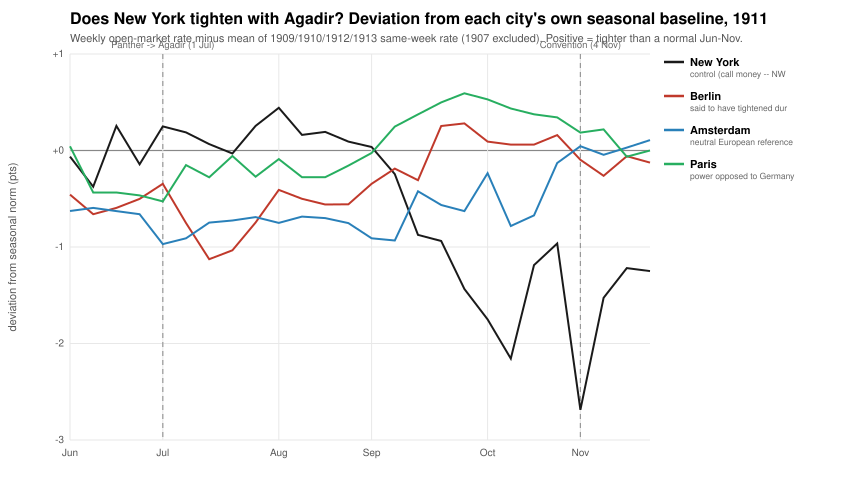

# Does the New York control hold for Agadir?

**Question.** During the Agadir crisis (roughly 1 July – 4 November 1911) Berlin's
money market tightened. Was that a *war-risk* signal, or the ordinary European autumn
seasonal — and did **New York**, outside the European alliance system, share any of
it? New York is the control: if the tightening prices a European war, a market
insulated from one should not move with it.

**Method (descriptive — no estimation, no significance tests).** For each city, take
its weekly open-market rate over 1 June – 30 November and subtract *its own* seasonal
baseline — the mean of the same calendar weeks across **1909, 1910, 1912, 1913**.
**1907 is excluded on purpose** (not silently): it carries the 1907 panic — New York
call money hit 20% — which would swamp every other year and manufacture a spurious
"calm 1911". The deviation strips out the common autumn seasonal, leaving the
year-specific, Agadir-specific movement. Weeks are aligned by ISO week (all four
cities share the same survey date each week; years drift only a few days). Source:
Neal–Weidenmier weekly short rates (`stinterestrates.xls`).

**One caveat on the New York series.** Neal–Weidenmier carry **no NY open-market /
discount rate**; the NY money-market rate is **call money**, used here as the
analogue. Call money is *more* seasonal (crop-moving demand) and more volatile than a
European discount rate — so a *flat* 1911 is the more striking result, not an artifact
of a tame instrument.

## Chart



*Deviation (points) of each city's 1911 weekly rate from its own 1909/1910/1912/1913
seasonal norm. Zero = a perfectly normal Jun–Nov. Dashed markers: 1 Jul (Panther →
Agadir) and 4 Nov (Franco-German convention).*

## Table

Baseline = mean of 1909, 1910, 1912, 1913 (1907 excluded), window 1 Jun – 30 Nov.

| city | peak tightening (dev > 0), and week | largest deviation (any sign), and week | baseline dispersion (SD) |
|---|---|---|---|
| **New York** (control) | **+0.44** pts — 5 Aug | **−2.69** pts — 4 Nov | 0.71 |
| Berlin | +0.28 pts — 30 Sep | −1.13 pts — 15 Jul | 0.69 |
| Amsterdam (neutral ref.) | +0.11 pts — 25 Nov | −0.97 pts — 1 Jul | 1.06 |
| Paris | +0.59 pts — 30 Sep | +0.59 pts — 30 Sep | 0.72 |

"Peak tightening" is the largest amount 1911 sat *above* the city's own seasonal norm
— the Agadir-specific signal. "Baseline dispersion" is the typical week-to-week
scatter of the four baseline years; a deviation smaller than it sits inside normal
year-to-year noise.

## Answer (the question, in plain prose)

**The New York control holds — emphatically.** New York call money sat dead flat at
2.00–2.50% for the entire window, never tightening above its own seasonal norm by more
than +0.44 points (early August, before the crisis climax). Because New York normally
tightens hard into the autumn crop-moving season, its 1911 flatness shows up as a
large *negative* deviation — running to **−2.7 points below its seasonal norm by early
November**, the exact weeks the Agadir war scare peaked. New York did not merely fail
to catch the crisis; it stayed conspicuously calm while its own seasonal clock said it
should have been tightening.

**And the continental "tightening" is mostly seasonal, not Agadir.** Berlin's absolute
rise (2.9% → 4.8%) is real, but it closely tracks Berlin's *normal* autumn seasonal:
the deseasonalized excess peaks at just **+0.28 points** (30 September, the war-scare
climax before the 4 November settlement) — inside one baseline SD (0.69). Amsterdam,
the neutral reference, ran *below* its norm all window. Only **Paris** — the power
directly opposed to Germany — shows a clear, sustained positive bump (**+0.59** at the
same late-September climax, fading by November), the one continental signal that looks
distinctly Agadir rather than seasonal. So the honest reading is: a modest war-risk
tightening in Paris and (smaller) Berlin at the crisis peak, none at all in the neutral
reference, and a control (New York) that not only stayed flat but sat far below where
its own calendar would have put it. That is exactly the pattern the New York control is
supposed to show when a crisis is European and does not spill across the Atlantic.

## Things flagged in the underlying series

- **New York is call money, not discount** (no NY discount series exists in NW) — see
  the caveat above. Its baseline dispersion (SD 0.71) and autumn seasonal are both
  large, so its deviations are the noisiest here; the *sign and persistence* of the
  1911 shortfall carry the finding, not any single week.
- **1907 excluded, and it matters:** the 1907 New York autumn (call money → 20%) is a
  panic, not a seasonal norm; including it would have doubled the apparent 1911
  shortfall for the wrong reason. Excluding it is the conservative choice.
- **Amsterdam's baseline is the most dispersed** (SD 1.06), driven by 1909 being
  unusually easy and 1910 unusually tight; read its small deviations with that in mind.
- All deseasonalized continental signals are **small relative to baseline dispersion**
  — consistent with "no significance language": this check establishes *direction and
  pattern*, not a tested magnitude.

## Reproduce

```bash
cd war_premia && python ny_control_agadir.py   # prints the table, writes results/ny_control_agadir.svg
```

Source: Neal–Weidenmier Gold Standard Database, weekly short-term rates.
